While I was writing a neural network from scratch -- NumPy, CuPy for GPU (I really should just learn PyTorch and stop putting it off) -- I had questions about how developers actually tune hyperparameters in practice. I read this blog on Medium ["Tuning Hyperparameters in Machine Learning Models 101"](https://medium.com/@deniz.kenan.kilic/changing-hyperparameters-in-machine-learning-models-101-d969f51fe414) and a bunch of posts and comments on Reddit. This thread in particular, ["[D] How did they do hyper-parameter tuning for large models ... millions for just training?"](https://www.reddit.com/r/MachineLearning/comments/onbunj/d_how_did_the_do_hyperparameter_tuning_for_large/), summarizes what I found at a high level. The thread is about LLMs, but many of the high-level ideas around hyperparameter search carry over.

But reading wasn't enough, so I took the simplest dataset I know (MNIST) and ran 39 different architectures across 7 learning rates. That's 273 runs, plus one small baseline model I kept around as a reference point throughout (128, 64). 274 in total, which used only the softmax activation function for the final output and ReLU throughout all the hidden layers, for simplicity in comparison.

>*Thankfully, the time I spent wrestling with Kaggle was fruitful

## Learning Rate Matters Less

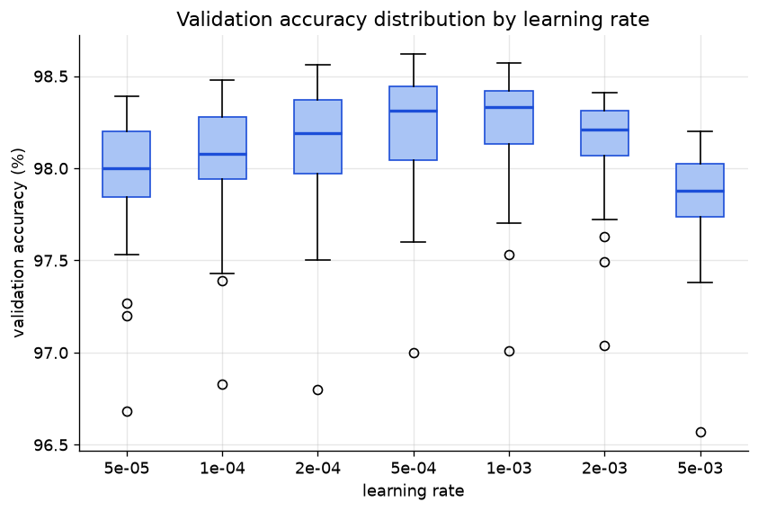

Honestly, I thought this graph would be squeezed together horizontally way more than it actually is. Adam optimization made the range of learning rates that work decently surprisingly wide.

5e-4 and 1e-3 are basically twins. Negligible difference, though 1e-3 features less variance. 5e-3 is the worst learning rate for 31/39 architectures. Not literally the worst *every* single time, for a few architectures, 5e-5 does worse.

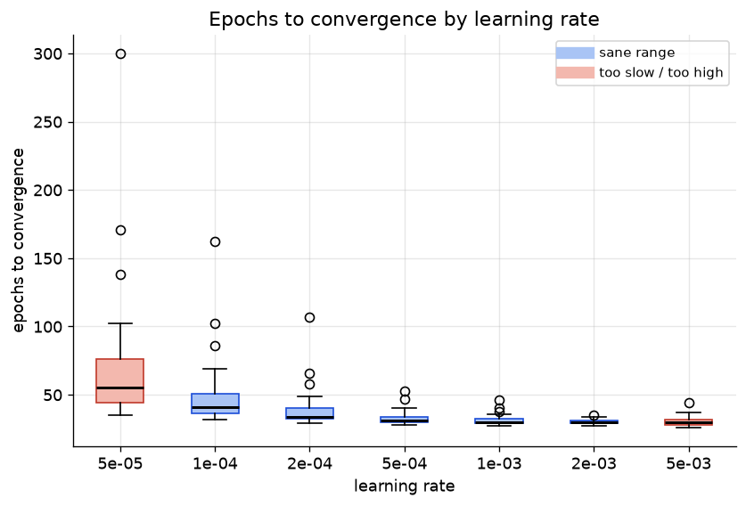

5e-5, the slowest rate needed roughly double the epochs of 5e-4 (69.6 vs 32.9 on average) just to end up at a slightly worse accuracy anyway...

If you keep the architecture constant and vary only the learning rate, accuracy moves by 0.47 points on average. Some architectures barely flinch -- the least sensitive one (`deep_funnel_sm`) swung only 0.22 points. The most lr-sensitive one (`uniform_md`) swung 0.69 points depending on the rate.

Now flip it around. Hold each learning rate fixed and only vary the architecture. The accuracy moves by 1.61 points on average, ranging from 1.37 to 1.76 depending on the rate. Every one of those 7 numbers is still bigger than the biggest lr-driven swing above.

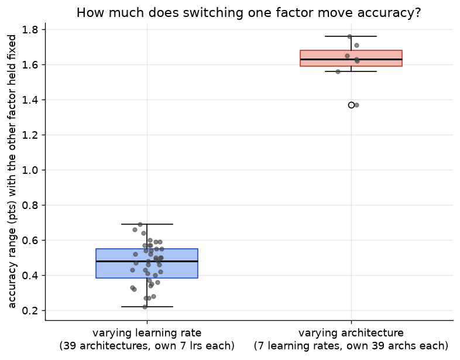

Switching architectures moves accuracy about 3.5x more than switching the learning rate does, and that gap holds NO MATTER which lr or which architecture you're looking at.

What I'm realizing is that learning rate mostly buys you speed, not accuracy. The same range (5e-4 to 2e-3) finished in about 32 epochs and 100 seconds at around 98.2% accuracy. The two bad ends (5e-5 and 5e-3) took around 50 epochs and 150 seconds to land at 97.9%

But there's one place where learning rate leaves a super obvious fingerprint even though it barely touches final accuracy - dead neurons. Run all 39 architectures across all 7 learning rates, hold each architecture fixed, and just watch what happens as the rate goes up. Every. single. Architecture showed the exact same pattern -- more dead ReLU units at higher rates. No exceptions across all 39.

Why does a higher LR cause more dead neurons? Because…

![A large gradient flowing through a ReLU neuron could cause the weights to update in such a way that the neuron will never activate on any datapoint again. If this happens, then the gradient flowing through the unit will forever be zero from that point on. That is, the ReLU units can irreversibly die during training since they can get knocked off the data manifold. For example, you may find that as much as 40% of your network can be "dead" (i.e., neurons that never activate across the entire training dataset) if the learning rate is set too high. With a proper setting of the learning rate, this is less frequently an issue.](274-mnist-runs/cs231n_stanford_relu_sensitivity.png)

this explanation is straight from the CS231n Stanford lecture notes, linked [here](https://cs231n.github.io/neural-networks-1/), and it perfectly describes why the dying happens. Seeing the graph helps understand this.

## Width vs Depth

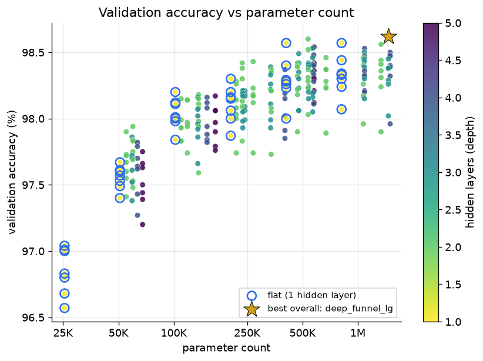

`xlarge_flat` -- one hidden layer, 512 neurons, 407K params hits 98.57% in 57.6 seconds. `deep_funnel_lg`, which has three hidden layers that taper [1024, 512, 256], only beats it by 0.05 points, while costing 3.6x the parameters and roughly double the training time. Depending on what you're optimizing for, that trade might not be worth it at all.

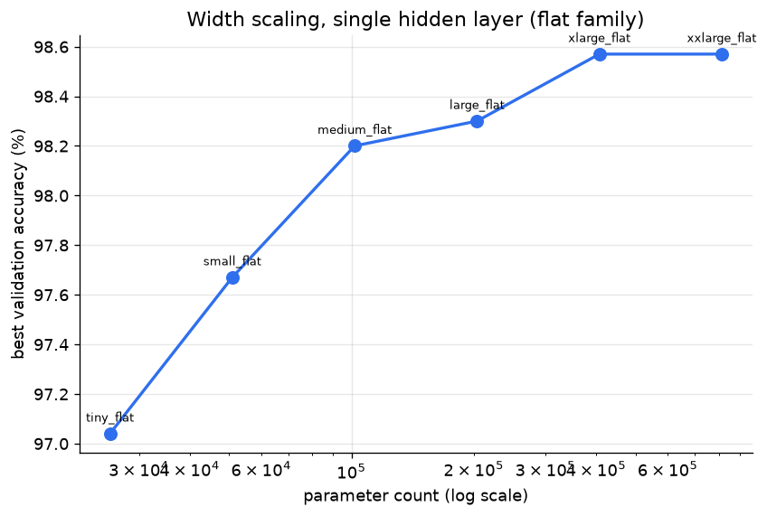

Going from 512 to 1024 neurons in a single flat layer buys you absolutely nothing at all. 98.57% both times. I re-ran both to make sure my logs hadn't been jumbled. They hadn't, though there was a tiny difference because of random weight initialization.

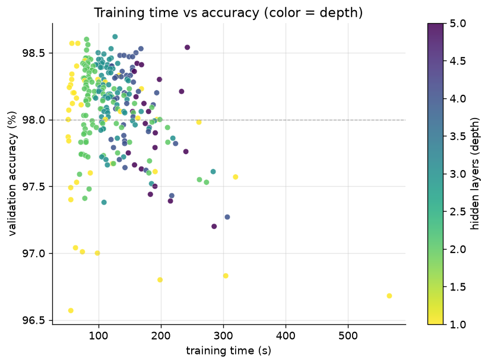

Color here is depth. The shallow end hangs out in the fast, cheap corner. Most of the darkest 4-5 layer dots don't even clear 98% on this dataset. So far, the story really does look like "keep it shallow, keep it wide!" (for MNIST).

## Best Model by a hair

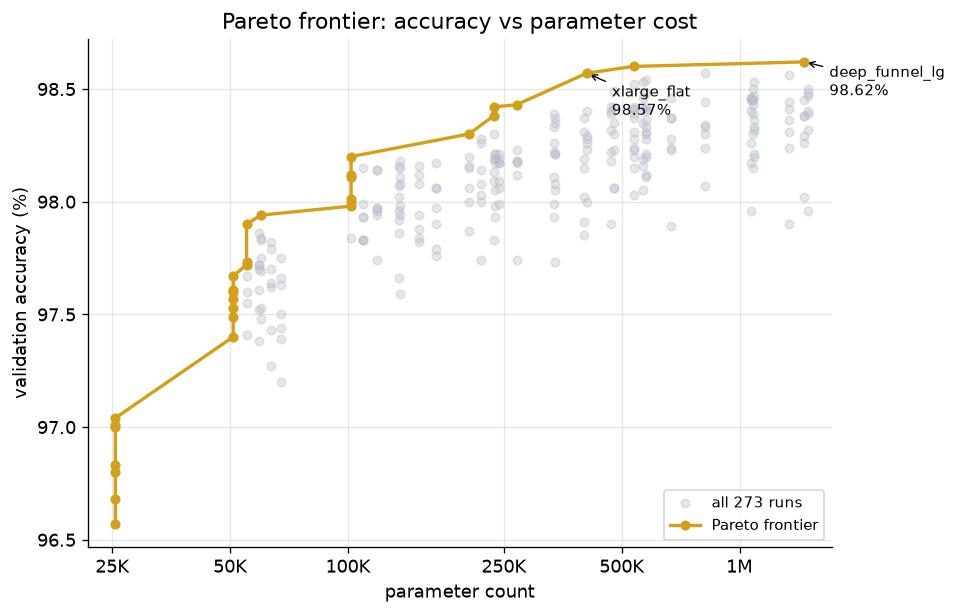

The top model of all 39 architectures is `deep_funnel_lg`, with an accuracy of 98.62%, 3 hidden layers, and tapering width. Second place goes to `funnel_lg`, also tapering but with only 2 hidden layers. `xlarge_flat` and `xxlarge_flat` come in third and fourth, tied at 98.57%.

Does depth actually buy anything once you account for how big the network is? Lining up similarly sized networks of different depths and comparing them directly, size seems to explain almost all of the difference. Depth on its own barely moves accuracy either way once two networks are in the same size range.

What DOES move it is shape. A network that tapers down as it goes (like a funnel) tends to edge out a same-sized flat or uniform-width network.

So "width beats depth" isn't quite right. It feels closer to: depth is almost free if you taper it on the way down, and it's a real cost if you keep the walls flat and push past three layers. There's still a practical takeaway worth holding onto: a single flat layer gets you most of the way there for a fraction of the cost of anything fancier. Depth can occasionally buy a tiny edge at the very top of the leaderboard. It just isn't what explains why some architectures in the middle of the pack underperform.

I think this is just because MNIST is a simple dataset. A stack of layers will help an MLP learn more complex features, but here that benefit is marginal. Most of the networks were already approaching 100% training accuracy, suggesting they had more than enough capacity for MNIST.

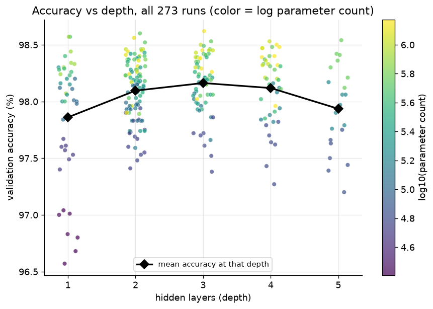

The MNIST dataset is a very basic, low-noise dataset. There's a trade-off between capacity and practical usefulness here that a harder dataset (something like [MNIST-C](https://arxiv.org/abs/1906.02337)) would probably push further out before hitting the same wall. Adding more layers increases a network's ability to model complex features, but only if the dataset actually has complexity that needs them. For MNIST specifically, the useful features get learned quickly, so extra depth mostly adds cost without adding much useful capacity on this dataset.

Making the network deeper past the point at which the dataset needs is like switching from an A4 notebook to an A3 one. More space to write, but if an A4 page already covers what you're doing, the extra room does nothing. And depending on how you use it, it can even get in the way. Sometimes an A5 notebook is actually better.

## Depth Hurts in Narrow Networks

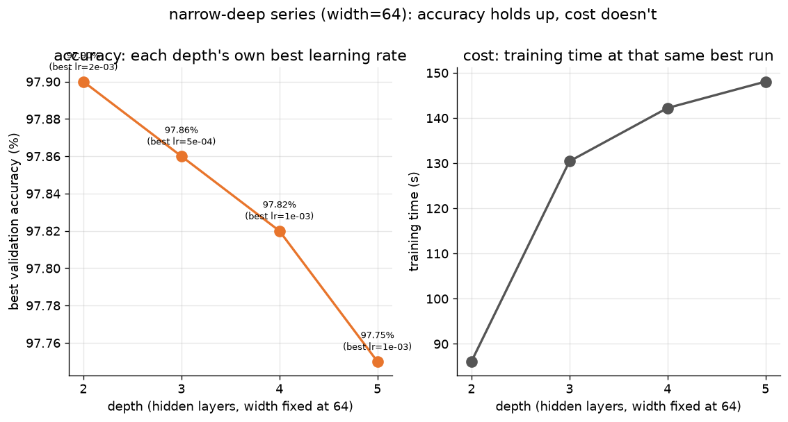

This is the cleanest failure mode in the whole run. Keep width fixed at 64, only change depth, and let each depth use its own best learning rate (2e-3, 5e-4, 1e-3, 1e-3, in that order). Accuracy consistently creeps down as you add layers: 97.90% -> 97.86% -> 97.82% -> 97.75%. And unlike everywhere else in the grid, this time the extra cost doesn't buy anything back. Training time climbs from 86 seconds at depth 2 to 148 seconds at depth 5. 72% more compute for what? a worse model...

My first guess for why: vanishing gradients. The gradients shrink on their way back to the input; early layers stop learning, and deeper nets suffer more. I wanted to sanity-check that idea, so I pinned the learning rate at 1e-3 across all four depths and compared the final gradient norms.

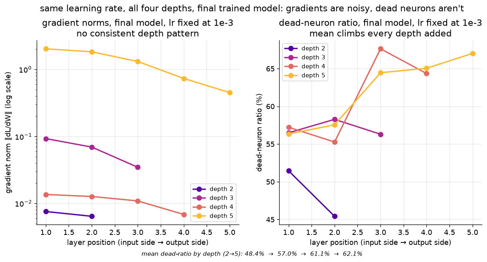

The gradient norms don't really tell a clean story. I was expecting to see them steadily shrink as depth increased, but they don't. The deepest network actually ends up with the largest gradients near the input. I don't see much evidence from the final gradient norms that vanishing gradients are the main thing driving the drop in accuracy here.

The dead-neuron data, however, shows a much clearer relation with depth. Dead-neuron fraction climbs steadily with every layer added: 48.4% at depth 2, 57.0% at depth 3, 61.1% at depth 4, 62.1% at depth 5. Cleanly monotonic, at the exact same learning rate, measured on each network's actual final weights. Every layer, at every depth, ends up with something like half to two-thirds of its 64 units outputting exactly zero. It almost feels like a bad game of telephone. Each layer starts with a large chunk of its neurons permanently silent, so the next layer has fewer active features to build on. Stack enough of those layers together, and it's easy to imagine the representation gradually becoming less expressive-not because the gradients necessarily disappeared, but because so much of each layer has already gone quiet.

This explanation makes the most sense to me, but I'm not convinced it's the whole story.

I could really use a second opinion here. I logged a lot more than what's in the graphs here and what I could interpret on my own. My *context window* expired (pun intended).

I couldn't find anything that convincingly explains why the narrow-deep models degrade the way they do. Maybe I'm missing something obvious. If you spot a pattern I didn't, I'd love to know.

You can find the link to the logs at the beginning of the post.

## Dead Neurons

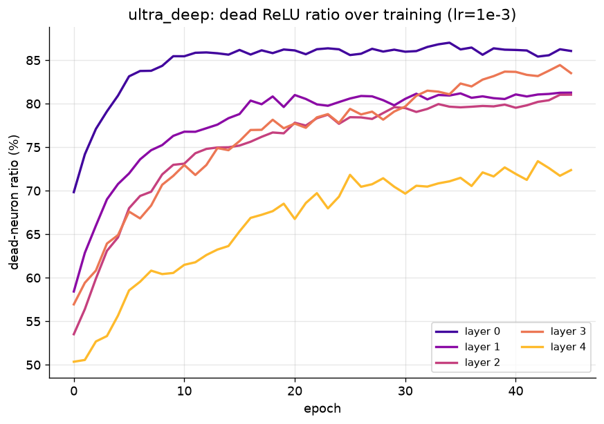

`ultra_deep`'s widest layer (512 units, right after the input) ends up the *most* dead of the whole network: 86% outputting exactly zero by the end, starting at 70% dead at epoch 0 and only climbing. The baseline's two layers, by contrast, settle into 24-30% and barely move after epoch 10.

I assumed the surviving units in a mostly dead layer would be the ones working overtime to compensate. That's backwards.

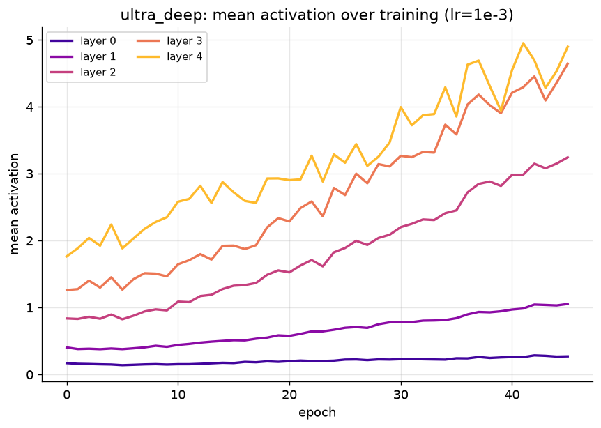

Layer 0 (512 units, 86% dead) finishes training with a mean activation of 0.27, despite carrying the most dead weight in the network. Layer 4 (32 units, 72% dead, the *least* dead layer in the stack) finishes at 4.90, eighteen times louder. My guess is that this comes down to what each layer is doing. Layer 0 has 512 units to extract rough structure from 784 raw pixels, so it can afford to let most of them sit idle. Layer 4 has 32 units left to push toward one of 10 answers, so every one that's still alive has to actually pull its weight.

## A Side Note

One thing I kept running into when comparing close models: the one with lower validation loss wasn't always the one with higher validation accuracy. It makes sense once you separate what each number measures: loss cares how *confident* the model was on the right answer; accuracy just cares whether it picked the right one at all. A model can get more confident about answers it was already getting right, which drops the loss without touching accuracy. Or it can flip a few borderline guesses correctly while getting slightly less sure everywhere else, raising accuracy while loss ticks up. Lower loss looks like "improving," but it isn't automatically the same thing as "getting more things right."

## Pruning

The dead-neuron observations led to an obvious question: if a big chunk of a layer is doing nothing, can you cut it out and retrain something smaller that does the same job? I ran that across all 274 original architectures, a full-dataset dead-neuron check per unit, cutting anything dead above an 80% threshold, retraining the smaller network from scratch at the same learning rate the original used. 148 out of 274 had enough dead weight to be worth cutting (the rest got skipped - I don't believe trimming 6% of one layer is worth a full retrain). The other 126 stayed as-is.

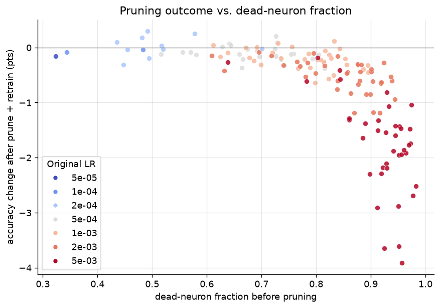

The headline: `deep_steep_md` at 5e-4 went from 1,083,338 params and 98.57% down to **294,697 params** and **98.78%** (for reference, that's around 1.18 mb in FP32), beating the best model from the original 274-run grid while using about a quarter of the parameters. That's a new best, found by cutting a bigger network down rather than searching for it directly.

But that's the best case, not the typical one. Averaged across all 148 retrained models, accuracy droppedby  0.66 points, and only 15 came out ahead. The color in the chart above is the original learning rate, and it's not a clean "5e-3 bad, everything else fine" split. The outcome gets steadily worse as the original learning rate climbs, tracking right along with how much of each network was already dead and how much ended up getting cut:

| learning rate | pruned runs | mean dead-neuron frac | mean % of units pruned | mean delta accuracy |
|---|---|---|---|---|
| 5e-05 | 1 | 32.3% | 14.4% | -0.16 |
| 1e-04 | 2 | 41.3% | 9.7% | -0.06 |
| 2e-04 | 10 | 51.2% | 12.5% | +0.03 |
| 5e-04 | 25 | 68.9% | 30.3% | -0.11 |
| 1e-03 | 33 | 77.5% | 49.4% | -0.21 |
| 2e-03 | 38 | 84.3% | 68.0% | -0.52 |
| 5e-03 | 39 | 91.6% | 84.5% | -1.76 |

barely any loss on average through 2e-4 and 5e-4, then a real slide starting at 1e-3, and a cliff at 5e-3: the worst single case there dropped 3.91 points.

>(Turns out cutting dead units and retraining smaller is already a known move -- I didn't realize that until I went looking for why this graph looked the way it did. There's a decent [overview of one-shot vs. iterative pruning](https://pohsoonchang.medium.com/neural-network-pruning-update-cda56343e5a2) if you want the actual term for what I was doing badly.)

The reason isn't that pruning in itself gets riskier, or that learning rate and pruning have some direct relationship.

The gradient of ReLU units is exactly 0 for any input below zero, so once a unit stops firing, no gradient ever reaches it again to revive it. Hence the name *"**dead** neuron"*. Higher learning rates just produce more of these permanently in the first place. Described in the `Dead Neurons` subheading of this blog.

My pruning rule was an 80% dead-threshold, which had no cap on how much of a layer it was allowed to take out in one pass; it just prunes anything past the cutoff, whether that leaves a layer at 300 units or at 4. For the 5e-3 runs specifically, that fixed threshold gutted some layers all the way down to the `min_units=4` floor regardless of how big they started: `steep_md`'s [512, 128] came out as [31, 4]; `funnel_xl`'s [1024, 512] came out as [28, 4]. That's not trimming dead weight...

This is a real shortcoming of the pruning setup as I ran it here. A better version would cap how much of any one layer can be removed in a single pass, or prune iteratively over a few rounds instead of one hard cutoff, so a layer never gets driven anywhere near the floor in one shot. `tiny_flat` at a sensible rate hits 97.00% with 25K params; pruned-down 5e-3 models in that same param range average close to 96%, with the worst case dropping to 94.35%. A smaller, more careful cut of those same networks would probably have landed a lot closer to `tiny_flat`'s number instead.

I stopped here. If I end up doing that rerun, I'll update this post with the results.

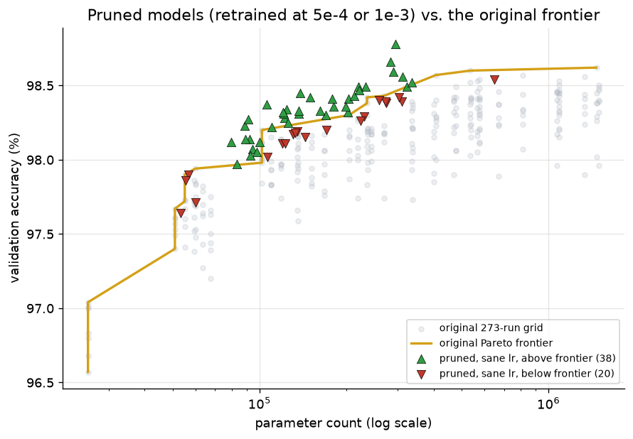

The gray dots are all 273 runs from the original grid, and the gold line tracing their upper-left edge is that grid's Pareto frontier: the best accuracy anyone got at or below each parameter count. The triangles are the 58 pruned-and-retrained models from the sensible-rate group, green pointing up if that model beats the gold line at its own size, red pointing down if it doesn't.

Filtering to just the pruned models retrained at a sensible rate (5e-4 or 1e-3), 58 of them, flips the picture: mean accuracy change is basically a wash at -0.16 points, and 38 of those 58 land **above** the original grid's own Pareto frontier at equal or smaller parameter count. That's genuinely better architecture than anything in the original search at that size.

So the finding can't be "pruning works" or "pruning doesn't work." It's that pruning only does what I'd hoped if you also fix the learning rate on the way back in. Cut the dead weight, but don't retrain it with the same setting that made it dead in the first place.

---

## Appendix

### Setup

| Setting | Value |
|---|---|
| Dataset | MNIST |
| Hidden activation | ReLU |
| Output activation | Softmax |
| Loss | Categorical cross-entropy |
| Optimizer | Adam (β1 = 0.9, β2 = 0.999) |
| Batch size | 64 |
| Max epochs | 5000 (early stopping almost always ended runs well before this) |
| Early-stopping patience | 25 epochs for the 273-run grid; the baseline used patience = 10 |
| Seed | 42 (fixed across every run) |
| Learning rates swept | 5e-5, 1e-4, 2e-4, 5e-4, 1e-3, 2e-3, 5e-3 (39 architectures × 7 lrs = 273 runs) |
| Architectures swept | 39 (see full table below) |
| Baseline (fixed reference, not part of the grid) | [128, 64], lr = 1e-4 |

**Architecture "shape" families**, used to color a few figures both here and above:

- **flat** - a single hidden layer (`tiny_flat` ... `xxlarge_flat`)
- **funnel** - hidden width strictly decreases layer to layer (e.g. `[1024, 512, 256]`)
- **uniform** - every hidden layer is the same width (e.g. `[256, 256, 256]`); flat architectures also fall under "uniform" in the raw data since a single layer is trivially uniform
- **expanding** - hidden width strictly increases layer to layer (e.g. `[64, 128]`)
- **mixed** - non-monotonic, e.g. the bottleneck architectures that narrow then widen again (`[512, 128, 512]`)

### Results (pre-pruning)

Each row shows that architecture's *best* run across its 7 learning rates, pre-pruning. You can find more data for these in the `logs.zip` file, which I've linked to at the top of the post.

| # | Architecture | Shape | Depth | Hidden layer sizes | Params | Best LR | Best val. acc (%) | Train time (s) |
|---|---|---|---|---|---|---|---|---|
| 1 | deep_funnel_lg | funnel | 3 | 1024, 512, 256 | 1,462,538 | 5e-4 | 98.62 | 126.8 |
| 2 | funnel_lg | funnel | 2 | 512, 256 | 535,818 | 5e-4 | 98.60 | 81.1 |
| 3 | xxlarge_flat | uniform | 1 | 1024 | 814,090 | 5e-4 | 98.57 | 67.2 |
| 4 | xlarge_flat | uniform | 1 | 512 | 407,050 | 1e-3 | 98.57 | 57.6 |
| 5 | funnel_xl | funnel | 2 | 1024, 512 | 1,333,770 | 2e-4 | 98.56 | 83.3 |
| 6 | ultra_deep | funnel | 5 | 512, 256, 128, 64, 32 | 576,810 | 1e-3 | 98.54 | 242.6 |
| 7 | deep_funnel_md | funnel | 3 | 512, 256, 128 | 567,434 | 2e-4 | 98.53 | 120.4 |
| 8 | v_deep_steep | funnel | 4 | 1024, 256, 64, 32 | 1,085,098 | 1e-3 | 98.53 | 168.2 |
| 9 | deep_steep_md | funnel | 3 | 1024, 256, 64 | 1,083,338 | 5e-4 | 98.50 | 99.7 |
| 10 | v_deep_md | funnel | 4 | 1024, 512, 256, 128 | 1,494,154 | 1e-3 | 98.50 | 160.3 |
| 11 | deep_steep_sm | funnel | 3 | 512, 128, 64 | 476,490 | 5e-4 | 98.49 | 108.9 |
| 12 | v_deep_sm | funnel | 4 | 512, 256, 128, 64 | 575,050 | 5e-4 | 98.48 | 134.6 |
| 13 | steep_lg | funnel | 2 | 1024, 256 | 1,068,810 | 5e-4 | 98.46 | 79.5 |
| 14 | uniform_lg | uniform | 2 | 512, 512 | 669,706 | 1e-3 | 98.46 | 84.4 |
| 15 | uniform_md | uniform | 2 | 256, 256 | 269,322 | 5e-4 | 98.43 | 83.2 |
| 16 | steep_md | funnel | 2 | 512, 128 | 468,874 | 1e-3 | 98.42 | 83.2 |
| 17 | funnel_md | funnel | 2 | 256, 128 | 235,146 | 1e-3 | 98.42 | 75.2 |
| 18 | bottleneck_md | mixed | 3 | 512, 128, 512 | 538,762 | 1e-4 | 98.42 | 131.0 |
| 19 | deep_uniform_md | uniform | 3 | 256, 256, 256 | 335,114 | 5e-4 | 98.39 | 105.0 |
| 20 | expand_lg | expanding | 2 | 256, 512 | 337,674 | 1e-3 | 98.37 | 78.8 |
| 21 | v_deep_unif_md | uniform | 4 | 256, 256, 256, 256 | 400,906 | 1e-3 | 98.37 | 154.8 |
| 22 | large_flat | uniform | 1 | 256 | 203,530 | 2e-3 | 98.30 | 57.4 |
| 23 | steep_sm | funnel | 2 | 256, 64 | 218,058 | 2e-3 | 98.28 | 80.6 |
| 24 | deep_funnel_sm | funnel | 3 | 256, 128, 64 | 242,762 | 5e-4 | 98.21 | 102.9 |
| 25 | bottleneck_sm | mixed | 3 | 256, 64, 256 | 236,618 | 1e-3 | 98.21 | 98.9 |
| 26 | medium_flat | uniform | 1 | 128 | 101,770 | 1e-3 | 98.20 | 61.0 |
| 27 | expand_md | expanding | 2 | 128, 256 | 136,074 | 5e-4 | 98.18 | 83.3 |
| 28 | ultra_deep_unif | uniform | 5 | 128, 128, 128, 128, 128 | 167,818 | 1e-3 | 98.17 | 160.4 |
| 29 | v_deep_unif_sm | uniform | 4 | 128, 128, 128, 128 | 151,306 | 5e-4 | 98.16 | 129.9 |
| 30 | deep_uniform_sm | uniform | 3 | 128, 128, 128 | 134,794 | 5e-4 | 98.16 | 115.4 |
| 31 | funnel_sm | funnel | 2 | 128, 64 | 109,386 | 1e-3 | 98.15 | 84.5 |
| 32 | uniform_sm | uniform | 2 | 128, 128 | 118,282 | 1e-3 | 98.14 | 80.1 |
| 33 | expand_sm | expanding | 2 | 64, 128 | 59,850 | 5e-4 | 97.94 | 96.8 |
| 34 | narrow_deep_2 | uniform | 2 | 64, 64 | 55,050 | 2e-3 | 97.90 | 86.1 |
| 35 | narrow_deep_3 | uniform | 3 | 64, 64, 64 | 59,210 | 5e-4 | 97.86 | 130.4 |
| 36 | narrow_deep_4 | uniform | 4 | 64, 64, 64, 64 | 63,370 | 1e-3 | 97.82 | 142.2 |
| 37 | narrow_deep_5 | uniform | 5 | 64, 64, 64, 64, 64 | 67,530 | 1e-3 | 97.75 | 148.1 |
| 38 | small_flat | uniform | 1 | 64 | 50,890 | 2e-4 | 97.67 | 122.5 |
| 39 | tiny_flat | uniform | 1 | 32 | 25,450 | 2e-3 | 97.04 | 63.4 |

### Top 5 pruning runs

| Architecture | Original LR | Hidden sizes (before -> after) | Params (before -> after) | Val. acc % (before -> after) | Δ accuracy (pts) |
|---|---|---|---|---|---|
| v_deep_unif_md | 2e-4 | [256, 256, 256, 256] -> [246, 238, 219, 229] | 400,906 -> 356,917 | 98.19 -> 98.49 | +0.30 |
| deep_funnel_lg | 2e-4 | [1024, 512, 256] -> [766, 465, 230] | 1,462,538 -> 1,067,455 | 98.45 -> 98.70 | +0.25 |
| deep_steep_md | 5e-4 | [1024, 256, 64] -> [290, 192, 55] | 1,083,338 -> 294,697 | 98.57 -> 98.78 | +0.21 |
| ultra_deep | 2e-4 | [512, 256, 128, 64, 32] -> [447, 243, 109, 53, 27] | 576,810 -> 493,923 | 98.42 -> 98.60 | +0.18 |
| xxlarge_flat | 1e-3 | [1024] -> [364] | 814,090 -> 289,390 | 98.47 -> 98.59 | +0.12 |

---

If you notice something I missed or something I've interpreted incorrectly, please let me know. Would love to know what I've got wrong