## What the paper actually is

"Attention Is All You Need" is a 2017 paper that introduced THE **transformer**. Pretty much every major LLM chatbot you may be using today — ChatGPT, Claude, Gemini, DeepSeek, etc. — is based on transformers.

A huge amount of the AI progress you've seen over the last few years can be traced back to this architecture, directly or indirectly. It revolutionized almost every domain in AI, if not all, language Translation (its original purpose), Computer Vision, etc.

## The Problem

What we want is a machine that can read a sentence and write another one, like translating it. To do that, it needs some way to capture what the sentence *means*.

You have a sentence — "I love cats" — can this be expressed in 2 words? [love, cats]? [I, cats]? Not quite right, hmmm... None of these captures the entire meaning.

Now imagine a full paragraph:

> My name is Yoshikage Kira. I'm 33 years old. My house is in the northeast section of Morioh, where all the villas are, and I am not married. I work as an employee for the Kame Yu department stores, and I get home by 8 PM at the latest every day. I don't smoke, but I occasionally drink. I'm in bed by 11 PM, and make sure I get eight hours of sleep, no matter what. After having a glass of warm milk and doing about twenty minutes of stretches before going to bed, I usually have no problems sleeping until morning. Just like a baby, I wake up without any fatigue or stress in the morning. I was told there were no issues at my last check-up. I'm trying to explain that I'm a person who wishes to live a very quiet life. I take care not to trouble myself with any enemies, like winning and losing, that would cause me to lose sleep at night. That is how I deal with society, and I know that is what brings me happiness. Although, if I were to fight I wouldn't lose to anyone.

— *Kira Yoshikage* — *Jojo's Bizzare Adventure Part 4 — Diamond is Unbreakable*

Yeah, that's not coming in 2 words. 10? 20? I don't think so. You WILL lose one of the other meanings, like in the previous example.

## One way to solve this

You can think about representing every word as a vector. Read the sentence one token at a time, and then modify a single "hidden vector" meant for encoding the entire sentence. The fully updated hidden vector holds the meaning of the entire message (in theory). It can be decoded back into your message, or, based on how you encode and decode these vectors, you can turn it back into the whole sentence, summarize it, fill in the blanks, etc., etc. The possibilities are endless!!

This is roughly what RNNs (recurrent neural networks), LSTM (long short-term memory), and GRU (gated recurrent unit) do, if you ignore their architecture-specific tweaks.

One catch: that single hidden vector is the "2 words" problem in disguise. One fixed-size vector has to hold everything, no matter how long the paragraph gets, and it's updated one token at a time, so the early stuff keeps getting overwritten.

However, processing tokens sequentially — like a Markov chain (rhetorically) — prevents parallelization across the sequence. During training, backpropagation through time also requires storing intermediate activations across the sequence, which increases memory usage.

Before this paper, several attempts had been made to attenuate this sequential nature. Some of these attempts are [Extended Neural GPU](https://proceedings.neurips.cc/paper/2016/hash/fb8feff253bb6c834deb61ec76baa893-Abstract.html), [ByteNet](https://arxiv.org/abs/1610.10099), and [ConvS2S](https://arxiv.org/abs/1705.03122) — they made things more parallel, but words far apart still took many steps to connect — and here we are introduced to the solution — Transformers. But before that, we should first understand the attention mechanism. (Attention already existed as a helper bolted in RNNs. This paper's hypothesis was to throw the RNN away entirely, using just Attention — hence "all you need".)

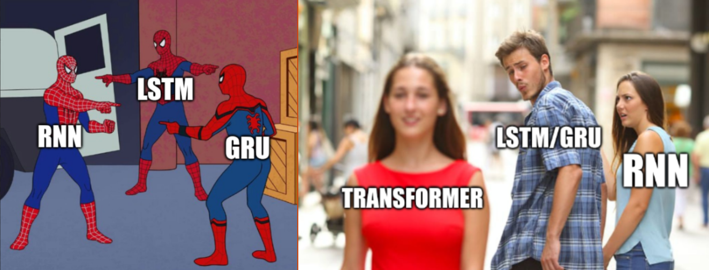

## Attention Mechanism (not cognitive)

Say you want to relate one word in the sentence to the others, but you need a precise mathematical way to do so, not just intuition. Take "My name is ved-in. What's your name?" You could summarize this as ["me", "ved-in", "you", "?"] But you can't write down the path you went through.

Instead of raw words, picture the sentence as a set of vectors. First, it is chopped into tokens (small pieces of text, not always whole words), and each token is assigned an ID. The same sentence run through the GPT-2 tokenizer gives you:

$$
 [3666, 1438, 318, 410, 276, 12, 259, 13, 1867, 338, 534, 1438, 30]
$$

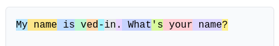
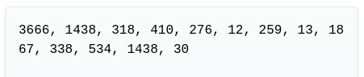

You can try this yourself at [tiktokenizer](eli5-attention-is-all-you-need/https://tiktokenizer.vercel.app/?model=gpt2). GPT-2 uses [Byte-Pair Encoding](https://www.geeksforgeeks.org/nlp/byte-pair-encoding-bpe-in-nlp/).

An ID is just a name tag; the number itself means nothing. Each of the 13 token IDs is looked up by a table and encoded into a vector (a list of numbers) of size $768$ (that's GPT-2's chosen dimension — other models use other sizes):

$$
 E_{\text{token}} = \begin{bmatrix} W_e[3666] \\ W_e[1438] \\ \vdots \\ W_e[30] \end {bmatrix}
   \in \mathbb{R}^{13 \times 768}
$$

Attention (coming up next) looks at all the tokens at once, like a bag of vectors, so "dog bites man" and "man bites dog" would look identical to it. An RNN knows this by reading one token at a time, but we're dropping that. The model should also know the *order* of the tokens, so it adds a separate vector for each position. In this paper, these vectors are **fixed sinusoidal** embeddings. They noted that with learned embeddings, they got nearly identical results. GPT-2 later swapped this for a learned table.

$$
 E_{\text{pos}} = \begin{bmatrix} W_p[0] \\ W_p[1] \\ \vdots \\ W_p[12] \end {bmatrix}
   \in \mathbb{R}^{13 \times 768}
$$

Add the two together to get the model's actual input: $X = E_{\text{token}} + E_{\text{pos}}$. ($W_e$ is the embedding table from above, and $W_p$ is the same idea for positions — sinusoids in this paper, a learned table in GPT-2.)

the sinusoid math

The sinusoidal embeddings:
$$
 P E(pos,2i) = \sin(pos/10000^{2i/d_{model}})
$$

$$
 P E(pos,2i+1) = \cos(pos/10000^{2i/d_{model}})
$$

Where $\text{pos}$ is the position and $i$ is the dimension, each dimension of the positional encoding corresponds to a sinusoid, with wavelengths forming a geometric progression from $2\pi$ to $10000 \cdot 2\pi$. This function was chosen because the authors hypothesized it would allow the model to easily learn to attend by relative positions, since for any fixed offset $k$, $\text{PE}_{\text{pos}+k}$ can be represented as a linear transformation of $\text{PE}_{\text{pos}}$.

$$
   \left[
       \begin{matrix}\sin (\omega (\text{pos}+k))\\ \cos (\omega (\text{pos}+k))\end{matrix}
   \right]
 =
  
   \left[\begin{matrix}\cos (\omega k)&\sin (\omega k)\\ -\sin (\omega k)&\cos (\omega k)\end{matrix}\right]
   \left[\begin{matrix}\sin (\omega \cdot \text{pos})\\ \cos (\omega \cdot \text{pos})\end{matrix}\right]
$$

Now for the actual attention step. The model has three learned weight matrices:
- $W_{\text{Q}} \in \mathbb{R}^{d_{\text{model}} \times d_{\text{k}}}$ (turns a token vector into a "Query")
- $W_{\text{K}} \in \mathbb{R}^{d_{\text{model}} \times d_{\text{k}}}$ (turns a token vector into a "Key")
- $W_{\text{V}} \in \mathbb{R}^{d_{\text{model}} \times d_{\text{k}}}$ (turns a token vector into a "Value")

Every token gets its own Query, Key, and Value vectors, computed in parallel.

Think of searching the web: the Query is what you typed in the search bar, the Key is each page's title and tags, and the Value is the actual page content. You match your Query against the titles, then read mostly the best-matching pages. Three separate matrices because what a token is looking for, how it advertises itself, and what it hands over are different things.

$$
 Q = XW_{\text{Q}}
$$

$$
 K = XW_{\text{K}}
$$

$$
 V = XW_{\text{V}}
$$

The matrices $W_Q$, $W_K$, and $W_V$ are optimized via backpropagation after being initialized randomly. In other words, they start as random numbers, and training nudges them every time the model guesses wrong, until they become useful. The embedding table from earlier works the same way.

Now, to compare the queries against each Key, we multiply $Q$ by $K^T$ and scale the result by $\sqrt{d_k}$, yielding a **Score** matrix. Essentially, a similarity score is computed via dot products (multiply the matching numbers and add them up — the more two vectors point the same way, the bigger it gets) between every pair of tokens.

$$
 S = \frac{Q K^T}{\sqrt{d_k}}
$$

Run softmax along each row of $S$ to get a probability distribution from the scores (softmax turns any list of scores into percentages that add up to 100%, with bigger scores getting bigger shares), then multiply it by the value matrix $V$ to get the final representation of each token:

$$
   \text{Attention}(Q, K, V) = \text{softmax}\left(\frac{QK^T}{\sqrt{d_k}}\right)V
$$

In plain words: each token's new vector is a blend of every token's Value vector, mixed in the percentages softmax gave. The new vector for "it" might be 70% *"animal"*, 20% *"street"*, and the remaining 10% being a mixed bag. Same number of vectors as before, but each one now knows about its context. And none of this waits on anything else — it's all big matrix multiplications that a GPU can do in one shot. That's the speed-up from earlier.

At its core, it's all dot products, measured the same way. But, NO ONE. NOBODY really knows why this all works. We do understand *why* it's useful, but what we don't have is a complete mechanistic explanation of how trained Transformers implement what we observe. Come up with your own intuition. Here's one that's much better than anything I could frame.

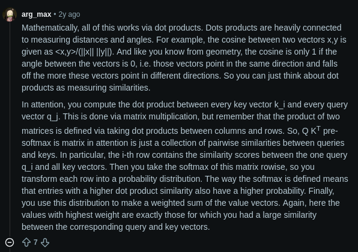
Source: https://www.reddit.com/r/learnmachinelearning/comments/1fbyvps/why_attention_works/

## Why Attention wins

The approaches we mentioned above — Extended Neural GPU, ByteNet, and ConvS2S — None of them fully escaped it. They attenuate it. The operations needed to relate two tokens still grow with the distance between them, linearly for ConvS2S, logarithmically for ByteNet.

Attention, as you just saw, sidesteps the *sequential dependency* between positions  —  every token compares against every other token in one step, regardless of distance. And since every token keeps its own vector, nothing gets squeezed into one hidden vector either. The problem is that this requires computing all pairwise interactions, which gives standard self-attention an $O(n^2)$ time complexity and memory usage, where $n$ is the embedded sequence length. But nothing's free. Averaging Attention over the whole sequence costs you resolution, a bit like blending five fruits into one smoothie: you lose the ability to taste any single one. The fix for the smoothie problem is **multi-head Attention** —  instead of one smoothie, make several in parallel, each free to focus on a different kind of relationship between tokens.

This doesn't necessarily mean that each head learns a single clean, human-interpretable function. It's just that multiple heads give the model several distinct attention patterns to use. However, later interpretability work has found some heads with an interpretable linguistic nature, but that's an *observation*, not guaranteed.

$$
   \text{head}_i = \text{Attention}(XW_i^Q,\; XW_i^K,\; XW_i^V)
$$

$$
   \text{MultiHead}(X) = \text{Concat}(\text{head}_1, \dots, \text{head}_h)\,W^O
$$

where

- $W_i^Q, W_i^K \in \mathbb{R}^{d_{\text{model}} \times d_k}$
- $W_i^V \in \mathbb{R}^{d_{\text{model}} \times d_v}$
- $W^O \in \mathbb{R}^{h d_v \times d_{\text{model}}}$ (mixes the heads back into one vector per token)

The paper uses $h = 8$ heads with $d_k = d_v = d_{\text{model}}/h = 64$ (the paper's $d_{\text{model}}$ is $512$, not GPT-2's $768$). Each head is smaller, so the total cost is about the same as one full-size head.

Below is a diagram depicting scaled dot-product Attention and multi-head Attention.

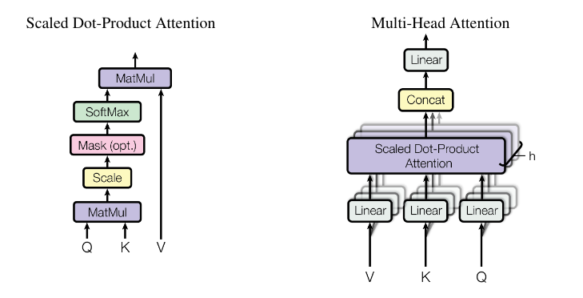

## Model Architecture

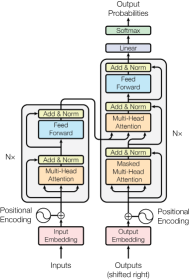

Okay, that's pretty daunting, right? But you already know a few of these boxes: the embeddings, the positional encoding, and the multi-head Attention.

Let's break it into two parts: the Encoder and Decoder. The encoder reads and understands the input sentence, and the decoder writes the output while looking back at what the encoder understood.

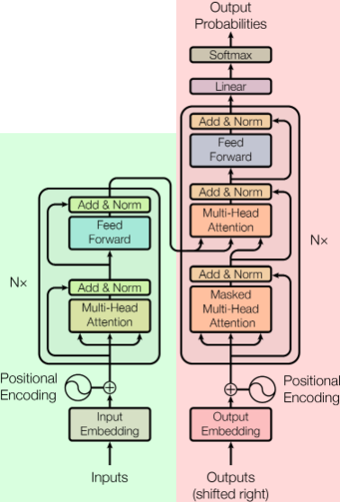

The encoder is highlighted green, while the decoder is highlighted red.

### 1. Encoder — highlighted green

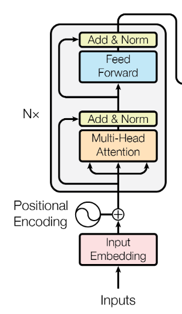

If you look at it as a step-by-step process, it's quite easy to think about it.

1. Inputs are fed into the model, where they are embedded into vectors through the embedding lookup table we looked at earlier. Then positional embeddings are added to it, referenced by the (+) sign.

2. Then it's fed into a multi-head attention block (explained earlier), after which it is added to the input it came in with and normalized.

> If you got confused by the 3 arrows entering the multi-head attention block, they represent your Query ($Q$), Key ($K$), and Value ($V$) matrix.

3. The hidden states (one vector per token this time, not one for the whole sentence) are then fed to a feed-forward neural network, after which they are again added and normalized with the input

> in the first block, the multi-head attention output is added to its input tensor ($x + \text{Attention}(x)$). In the second block, the feed-forward output is added to its input tensor ($y + \text{FFN}(y)$). This use of older hidden states is referred to as skip or residual connections.

This entire process is repeated $N$ times (each round refines the vectors a bit more) — and that's the end of the encoder part!!

Let us represent the output of the encoder by $H_{\text{enc}}$. It's still one vector per input token, so nothing got squeezed into a single vector.

### 2. Decoder — highlighted red

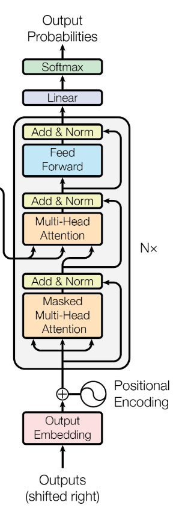

I believe this feels pretty *okay* to look at now, right?

But what is that output being fed into the bottom of the architecture?

Initially, there is no output. But we use special tokens to mark the start and end of the start sequence, generally represented by `<START>`/`<S>` and `<END>`/`<E>`. It really doesn't matter what you declare it to be. But here, let us use `<START>` and `<END>`, since that's easier.

The process starts at the bottom of the image. here

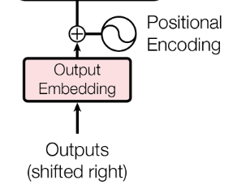

Suppose our input is the same as before, and our task is to translate it to Latin. (To keep things readable, I'll write whole words below instead of the 13 tokens. These are raw words, not the embedded $X$ from earlier.)

$$
 X = [\text{"My", "name", "is", "ved-in", ".", "What's", "your", "name", "?"}]^\top
$$

$$
 Y = [\text{"Nomen", "mihi", "est", "ved-in", ".", "Quod", "nomen", "tibi", "est", "?"}]^\top
$$

But because we use those special tokens, `<START>` and `<END>`, our actual output is supposed to be:

$$
 Y = [\text{<START>, "Nomen", "mihi", "est", "ved-in", ".", "Quod", "nomen", "tibi", "est", "?", <END>}]^\top
$$

take $\hat{Y}$ to be our model's output. It's initialized as

$$
   \hat{Y} = [\text{<START>}]^\top
$$

Initially, this is embedded and fed into that big block. Everything is the same except for masked multi-head Attention.

It's gone through one MMHA block, with the residual connections same as in the encoder, easy shit. But after that, you can see a 3-way input to the MHA block, with 2 arrows coming from the encoder block.

The two arrows from the encoder block are $K$ and $V$, both computed from $H_{\text{enc}}$. $Q$ comes from the decoder's own side. In search terms, the decoder asks, "Which part of the input do I need for my next word?" and the encoder's output is what gets searched.

After our decoder block, we have a tensor of size $N_{\text{input}} \times d_{\text{model}}$. This is multiplied by a weight matrix of size $d_{\text{model}} \times \mathcal{V}$ where $\mathcal{V}$ is your vocabulary size.

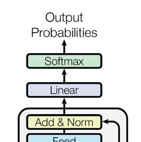

This gives us a tensor of size $N_{\text{input}} \times \mathcal{V}$. For each row, we apply the softmax function, yielding a probability for every token in the vocabulary. Generally, we consider only the last row of our logit tensor (the raw scores before softmax), since that row predicts what comes after everything so far, and apply argmax (pick the most likely token) to it to get our next token. Chatbots usually sample from the top few options instead, which is why they don't always answer the same way. This is repeated however many times required for the model to finish its response till it outputs the end token, `<END>.`

The output token is then added to the end of the decoder's input, and the process repeats.

What about that *masked* part, and the "shifted right" label on the diagram? That's about training. While *generating*, we loop like above because the future tokens don't exist yet. But during *training*, we already have the full correct answer $Y$, so we feed it in all at once (shifted right, so it starts with `<START>`). The mask is just covering the answer key.

**Side note:** This is the original transformer, built for translation, so it needs both halves. GPT-style chatbots (like the GPT-2 model in our tokenizer) retain only the decoder half, excluding the encoder arrows. Your prompt is simply the start of the sequence; it keeps going.

Now, you don't depend on a hidden representation that updates over time. But this inherent sequential nature persisted during generation. Well, for that, we have diffusion models, which are *not* sequential in that way; instead of 1 token at a time, they output an entire block of tokens at once. Outputting is not the right term here; refining is. It's still a transformer underneath, just used differently: start with a rough draft of the whole block, and keep improving it.

Take, for example, [DiffusionGemma](eli5-attention-is-all-you-need/https://blog.google/innovation-and-ai/technology/developers-tools/diffusion-gemma-faster-text-generation/). Google reports up to 4× faster generation under its benchmark conditions, while also describing its overall output quality as lower than standard Gemma 4. It's meant to make better use of consumer hardware (local, low-concurrency inference).

<video controls src="https://storage.googleapis.com/gweb-uniblog-publish-prod/original_videos/Diffusion_Process_3_1.mp4" title="DiffusionGemma"></video>

## So... did it work?

Absolutely!! By a lot. On English-to-German translation, the transformer achieved a 28.4 BLEU score (higher is better), beating every previous model by more than 2 points. On English-to-French, it set a new single-model record of 41.8 BLEU after 3.5 days on 8 GPUs, a fraction of what the previous best cost to train. The smaller base model was trained in just 12 hours.

And it wasn't a translation-only trick. The authors applied it to English constituency parsing with almost no task-specific tuning, and it held its own against models built specifically for that task.

## What the authors wanted next

In the conclusion, the authors say they wanted to take transformers beyond text to images, audio, and video, and to make generation *less sequential*. Sound familiar? Sounds like the diffusion idea from earlier.

## Remember Kira?

remember that paragraph that wouldn't fit into 2 words, or 20? The answer was not to squeeze. Keep every token as its own vector, let every token look at every other token, and let the model decide what matters.

## Go further

The paper is only ~15 pages. Look at the attention visualizations below. They are taken directly from the paper's appendix. Each line shows how much one word attends to another (thicker means more), and different colors represent different heads. You can see different heads seemingly picking up things like which noun "its" refers to.

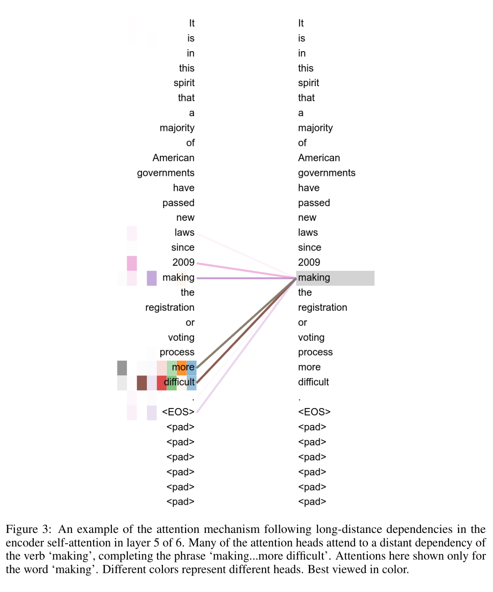
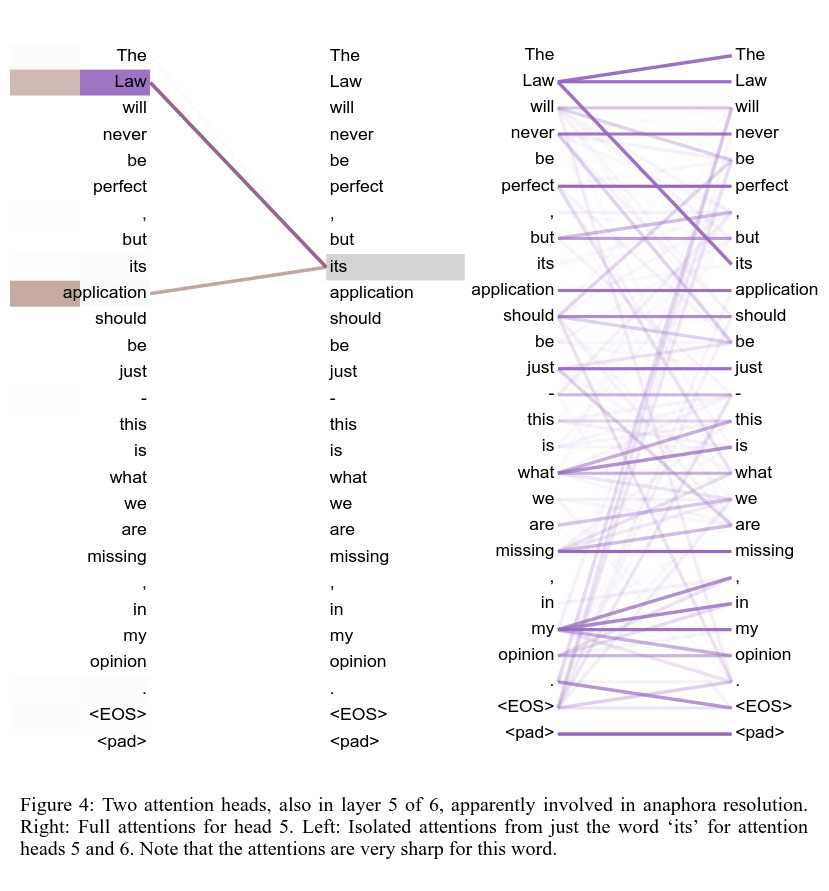
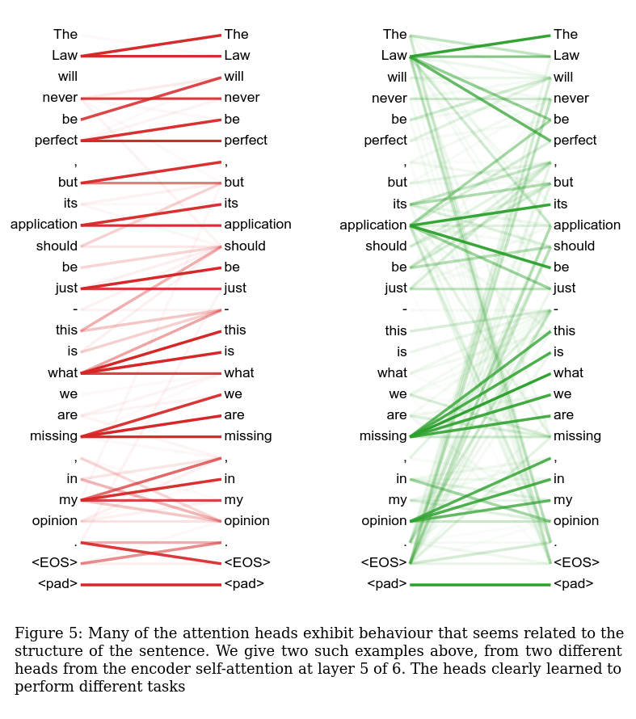